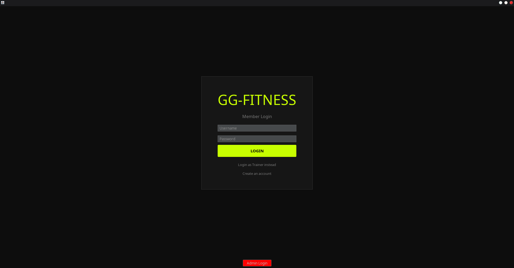
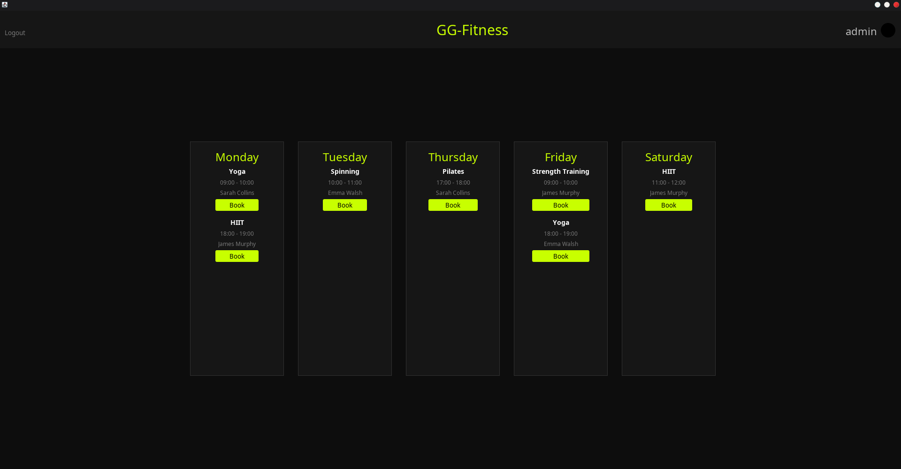
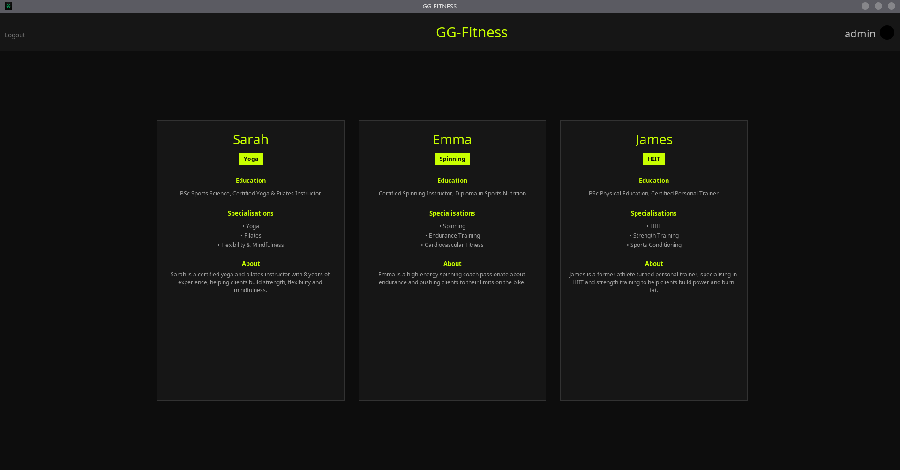
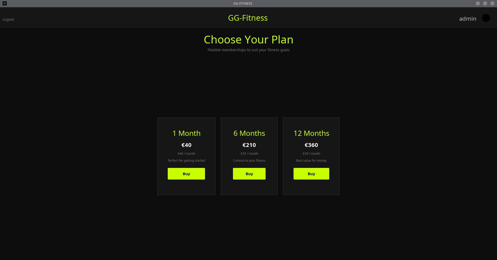
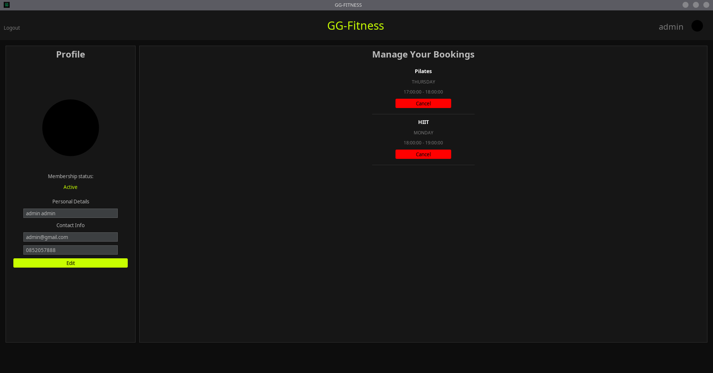

# 🏋️ GG Fitness

**GG Fitness** is a simple **Java desktop application** that helps manage gym operations — from memberships to class scheduling and trainer management.

---

## 💻 Features

- **🧑 User Accounts** – Register, login, and book classes  
- **💳 Memberships** – Purchase and track membership status  
- **📅 Class Scheduling** – View and book available classes  
- **🏋️ Trainer Management** – Assign trainers to classes  
- **🗄️ Database Integration** – MySQL + JDBC for all backend data  

---

## 🛠️ Tech Stack

- **Java Swing** for GUI
- **FlatLaf** for modern dark theme
- **MigLayout** for UI layout
- **MySQL** for database storage
- **JDBC** for database connection
- **Maven** for dependency management
- **BCrypt** for password hashing

---

## 📸 Screenshots

### Login Screen

### Booking Menu

### Meet The Trainers

### Memberships

### Profile

